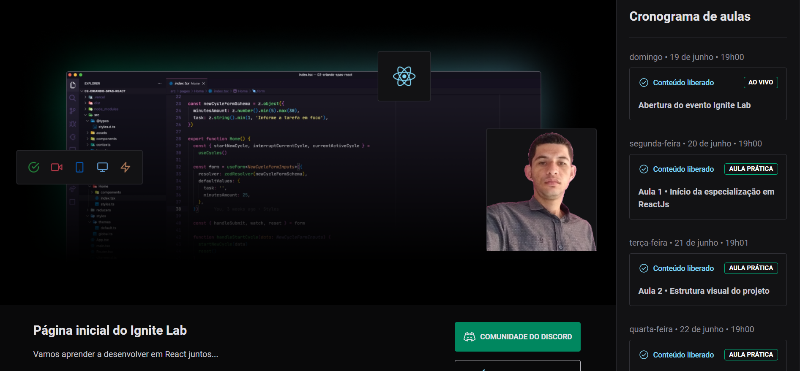

# Ignite Lab

<p align="center">
  
</p>

<h2 align="center">Tópicos 📋</h2>

   <p>

- [Sobre 📖](#sobre-)
- [Layout 🎨](#layout-)
- [Como Usar 🤔](#como-usar-)
- [Autor 🎓](#autor)

   </p>

---

## Sobre 📖

Este projeto foi desenvolvido durante a semana Ignite Lab da [Rocketseat](https://app.rocketseat.com.br) .

---

## Layout 🎨



Para visualizar a aplicação em funcionamento basta seguir o link:

[Ignite Lab Valdir Alves]()

---

```
- Clone esse repositório:
$ git clone https://github.com/valdir-alves3000/ignite-lab
- Entre no diretório:
$ cd ignite-lab
- Instale as dependências:
$ npm install
# or
yarn install
- Inicie o app:
$ npm run dev
# or
yarn dev
```

---

### Autor

[
<br />
<sub style="margin-right: 1rem;"><b>Valdir Alves </b></sub>🚀](https://github.com/valdir-alves3000/)

<p style="margin-top: 0.5rem;">Feito com ❤️ por Valdir Alves. Entre em contato!</p>

[](http://linkedin.com/in/valdiralves3000)
[](mailto:valdiralves3000@gmail.com)
